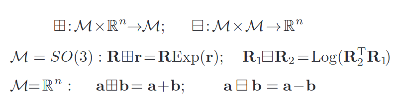
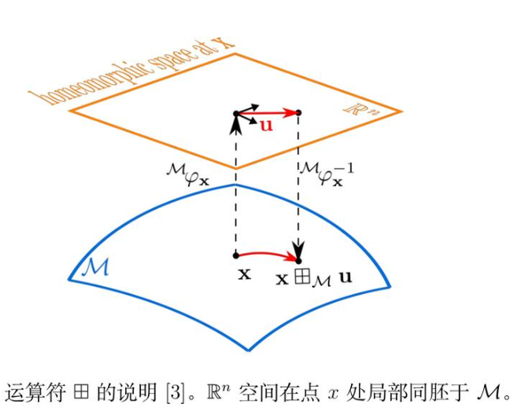
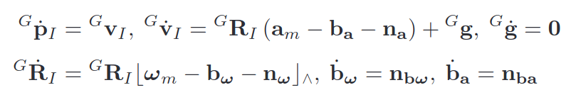
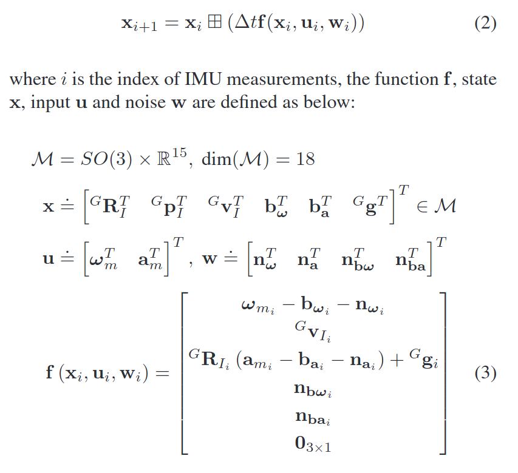
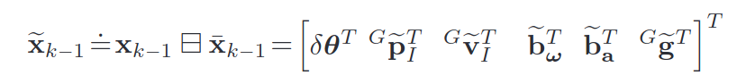

# Nvidia API Key
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
# 启动
ANTHROPIC_AUTH_TOKEN="freecc" ANTHROPIC_BASE_URL="http://localhost:8082" claude
# 启动服务
uv run fcc-server

# IMU数据特征
1. 采样频率高
2. 存在非零常值偏置、自然噪声等，导致显著积分误差
3. 重力加速度一直存在

# 点云畸变
1. 同一帧点云，实际上在不同时刻采集而成
2. 不同时刻，激光雷达的位置实际上发生了改变
3. 雷达数据相对于当前时刻激光雷达，参考系改变
4. 同一帧点云中的不同点有不同的参考系
5. 默认把这些点对齐到这一帧起始时刻坐标下

# 去畸变核心公式
$T(t_0)p^{deskew}_{i} = T(t_i)p_{i}$ \
$p^{deskew}_{i} = T(t_0)^{-1}T(t_i)p_{i}$ \
个人理解：
1. 后一时刻获得的点通过起始时刻的位姿变换到世界坐标系
2. 当前时刻获得的点通过当前时刻的位姿变换到世界坐标系
3. 在世界坐标系下这两组点是同样的

# 去畸变
1. PointCloud2消息中不含每个点的时间戳，需在时间上均匀近似
2. 每有一帧数据，就将每个点到$t_0$时刻的旋转矩阵算出

# 多帧点云匹配
目的：将当前帧变换到上一帧的位置，获得当前帧相对于上一帧的位姿变化$\Delta T$

$P_{k-1} \approx \Delta T_{k-1}P_k$

方法：ICP
1. 给当前点云找目标点云中的最近点
2. 根据对应点关系估计一个变换 T
3. 用 T 移动当前点云
4. 重复直到误差变小

## ICP
$$arg\,min_T \sum_{i}\|Tp_i - q_i\|^2$$

位姿累积：$while:T*=\Delta T$

# 回环检测
回到某一经过位置时，把历史上这个位置的“旧地图”和现在的“新扫描”进行匹配，算出一个长期的约束，消除累积误差
1. 检测，判断和历史某帧谁像
2. 几何验证，确认相似程度
3. 图优化，把历史位姿和当前位姿作为“顶点”，把匹配约束作为“边”，用优化算法调整全局轨迹  

主流方法：基于点云描述子（Scan Context / M2DP）；基于里程计约束（Odometry-based）；基于视觉

# 局部地图
- 最近若干帧点云叠加起来的一小块地图
- 当前帧不和上一帧匹配，而是和这个局部地图匹配

# 点云地图
地图中大量三维点，表示空间中被激光打到的位置
# 体素地图
把三维空间切成一个个小立方体，每个点会有体素索引，如：
$i = \lfloor \frac{x-x_0}{r} \rfloor$
- 降采样
- 占用统计
# 二维栅格地图
把三维点云投影到平面上，也有索引  
ROS里一般用：nav_msgs::msg::OccupancyGrid  
-1 未知 0 空闲 100 占据

---

# kd-tree
作用是把三维点云组织成树结构，使得空间查询更快。 \
在点云里，k通常是3，也就是：x, y, z 三维空间 \
递归地把空间切开，最终形成一棵二叉树。 \
地图不断增量更新，每来一帧点云都重建 kd-tree，点数多了以后会慢，适合静态地图。
# 最近邻搜索
给定一个查询点 q，找到地图中距离 q 最近的点。
## K 近邻搜索
K 近邻就是找最近的 K 个点 \
输出一般包括：点的索引,距离平方
# 半径搜索
给定查询点 q 和半径 r，找到所有距离 q 小于 r 的地图点，也就是：
$$\|p_i-q<r\|$$
# ikd-tree
新点来了，不一定重建整棵树；只把新点插入树；需要删除旧区域时，可以删除一部分点；树不平衡时再局部重建。

---

# 局部地图裁减
全局地图覆盖整个环境，但机器人当前只关心自己附近的一小块区域，从全局地图中取出机器人附近一定范围内的点，点数少，计算快  
- 根据当前位置裁减：局部地图会随机器人位置变化而变化
- 根据给定范围裁减：固定位置的地图会保留，与机器人当前位置无关

---

# scan-to-map配准
当前帧点云在雷达坐标系下，局部地图在世界坐标系下，估计一个变换：
$$T^{world}_{lidar}$$

平移误差：$e_t=t_{est}-t_{gt}$  
旋转误差：$R_{err}=\|R^T_{gt}R_{est}\|$ $e_R=\cos^{-1}(\frac{trace(R_err)-1}{2})$

---

# FAST-LIO
# 流形
局部具有欧几里德空间性质的空间：一个不能直接用平直坐标系全局描述，但可以在每个局部小范围用平直坐标系描述的空间
## 定义运算符

## 局部同胚

把空间切开，看极其微小一块时，可以无条件互相拉伸、扭曲、揉捏，只要不撕裂、不粘连，就能完全变成对方

- 广义加：对应使用指数映射，在x处添加小扰动u，在李群上做乘法
- 广义减：对应使用对数映射，确定这个扰动u

位姿放在流形$SE(3)$**李群**上，只能乘求逆不能加减；协方差(P、误差$\delta{x}$)全部放在流形局部的切空间里，也就是**李代数**空间$se(3)$，可以做线性的加减乘除求导

---

# Continuous and Discrete model
测量值=真值+零偏+噪声

通过定义的新运算，可以进行离散状态更新

---

# 状态估计
- $x$表示真值
- $\bar{x}$表示滤波算法结束后得到的最优估计
- $\hat{x}$表示滤波算法过程中得到的估计值
- $\tilde{x}$表示误差

有误差定义：

根据广义减运算，可得：$\delta\mathbf{\theta}^T=Log({}^G\mathbf{\bar{R}}^T_I{}^G\mathbf{R}_I)$，其他都是在欧式空间，能够直接相减
## 前向传播
1. 通过IMU积分与离散状态更新持续计算一个状态量，用于后续的反向传播来补偿运动失真
2. 传播误差量，并计算对应的协方差矩阵